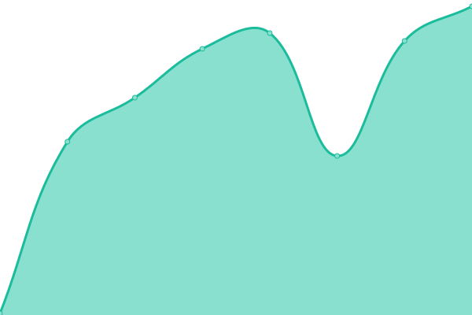
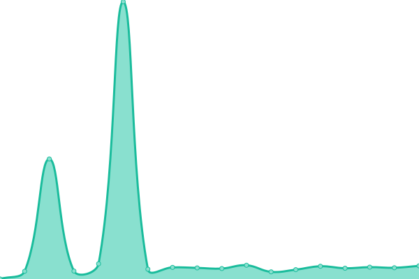
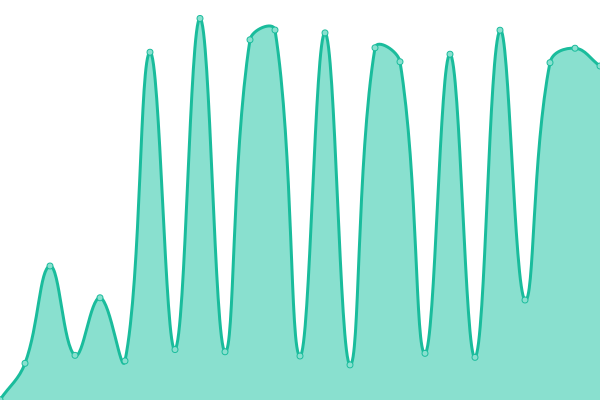
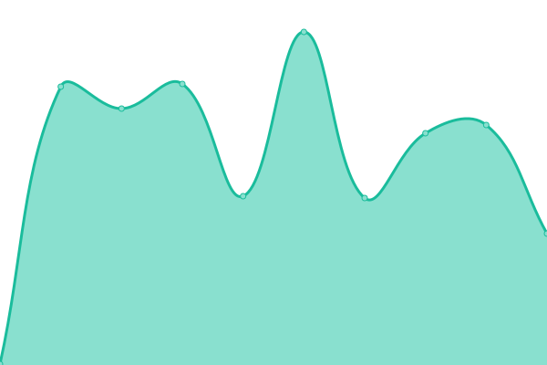
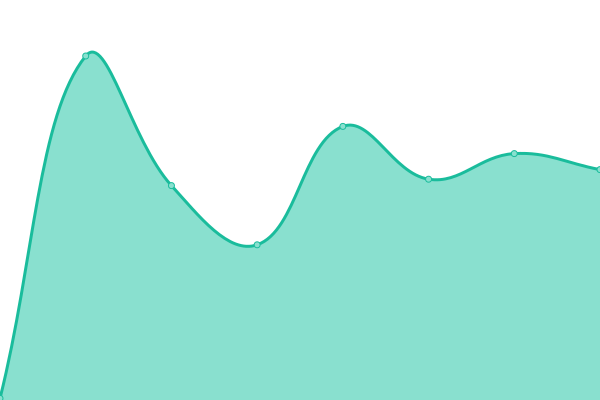
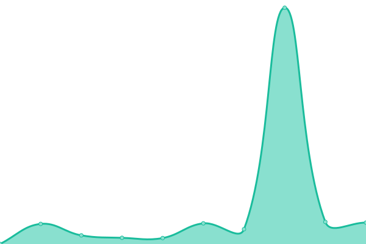
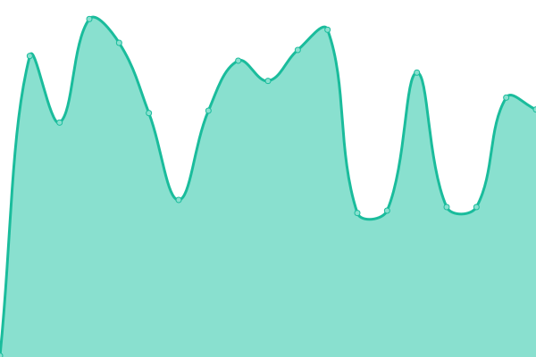
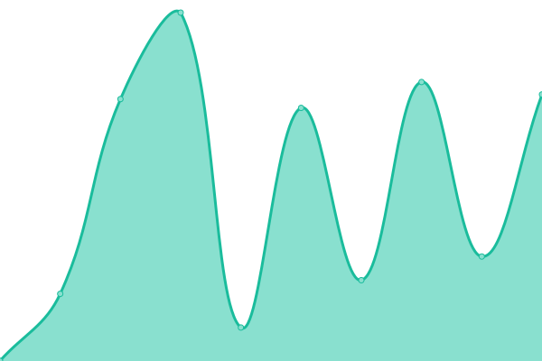

# [📈 Live Status](https://demo.upptime.js.org): <!--live status--> **🟩 All systems operational**

This repository contains the open-source uptime monitor and status page for [Wouter Planet](www.wouterplanet.com), powered by [Upptime](https://github.com/upptime/upptime).

With [Upptime](https://upptime.js.org), you can get your own unlimited and free uptime monitor and status page, powered entirely by a GitHub repository. We use [Issues](https://github.com/wouterplanet/monitoring/issues) as incident reports, [Actions](https://github.com/wouterplanet/monitoring/actions) as uptime monitors, and [Pages](https://demo.upptime.js.org) for the status page.

<!--start: status pages-->
<!-- This summary is generated by Upptime (https://github.com/upptime/upptime) -->
<!-- Do not edit this manually, your changes will be overwritten -->
<!-- prettier-ignore -->
| URL | Status | History | Response Time | Uptime |
| --- | ------ | ------- | ------------- | ------ |
|  [Wouter Planet](https://www.wouterplanet.com) | 🟩 Up | [wouter-planet.yml](https://github.com/wouterplanet/monitoring/commits/HEAD/history/wouter-planet.yml) | 

 176ms
     
 | 

<a href="https://wouterplanet.github.io/monitoring/history/wouter-planet">100.00%</a>
    

|  [Merch Site](https://merch.wouterplanet.com) | 🟩 Up | [merch-site.yml](https://github.com/wouterplanet/monitoring/commits/HEAD/history/merch-site.yml) | 

 351ms
     
 | 

<a href="https://wouterplanet.github.io/monitoring/history/merch-site">92.86%</a>
    

|  [Blog](https://blog.wouterplanet.com) | 🟩 Up | [blog.yml](https://github.com/wouterplanet/monitoring/commits/HEAD/history/blog.yml) | 

 910ms
     
 | 

<a href="https://wouterplanet.github.io/monitoring/history/blog">92.86%</a>
    

|  [API](https://api.wouterplanet.com/ping) | 🟩 Up | [api.yml](https://github.com/wouterplanet/monitoring/commits/HEAD/history/api.yml) | 

 593ms
     
 | 

<a href="https://wouterplanet.github.io/monitoring/history/api">100.00%</a>
    

|  [CDN](https://cdn.wouterplanet.com) | 🟩 Up | [cdn.yml](https://github.com/wouterplanet/monitoring/commits/HEAD/history/cdn.yml) | 

 231ms
     
 | 

<a href="https://wouterplanet.github.io/monitoring/history/cdn">92.85%</a>
    

|  [CDN 4](https://cdn4.wouterplanet.com) | 🟩 Up | [cdn-4.yml](https://github.com/wouterplanet/monitoring/commits/HEAD/history/cdn-4.yml) | 

 166ms
     
 | 

<a href="https://wouterplanet.github.io/monitoring/history/cdn-4">100.00%</a>
    

|  CDN Orange | 🟩 Up | [cdn-orange.yml](https://github.com/wouterplanet/monitoring/commits/HEAD/history/cdn-orange.yml) | 

 581ms
     
 | 

<a href="https://wouterplanet.github.io/monitoring/history/cdn-orange">100.00%</a>
    

|  Administration | 🟩 Up | [administration.yml](https://github.com/wouterplanet/monitoring/commits/HEAD/history/administration.yml) | 

 236ms
     
 | 

<a href="https://wouterplanet.github.io/monitoring/history/administration">92.85%</a>
    

|  Fun Delivery Service | 🟩 Up | [fun-delivery-service.yml](https://github.com/wouterplanet/monitoring/commits/HEAD/history/fun-delivery-service.yml) | 

 809ms
     
 | 

<a href="https://wouterplanet.github.io/monitoring/history/fun-delivery-service">92.85%</a>
    

|  [NAS](https://nas.wouterplanet.com) | 🟩 Up | [nas.yml](https://github.com/wouterplanet/monitoring/commits/HEAD/history/nas.yml) | 

 635ms
     
 | 

<a href="https://wouterplanet.github.io/monitoring/history/nas">100.00%</a>
    

<!--end: status pages-->

[**Visit our status website →**](https://demo.upptime.js.org)

## 📄 License

- Powered by: [Upptime](https://github.com/upptime/upptime)
- Code: [MIT](./LICENSE) © [Wouter Planet](www.wouterplanet.com)
- Data in the `./history` directory: [Open Database License](https://opendatacommons.org/licenses/odbl/1-0/)
